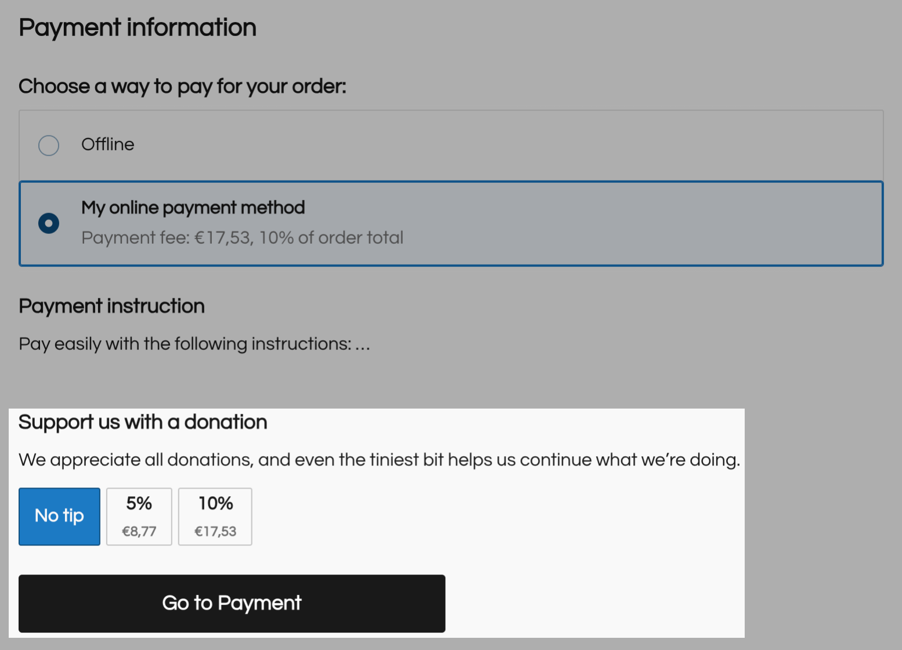

# Collect tips/donations at the checkout

You can collect tips or donations in your store by enabling a specific section at the last checkout step:

<figure><figcaption></figcaption></figure>

To do so, simply send a PUT request with the JSON-formatted body. There, define the \`tipsSettings\` object with all the settings inside.

Request example:

```json
PUT https://app.ecwid.com/api/v3/{storeId}/profile

{
    "tipsSettings": {
        "enabled": true,  //  must be `true`
        "type": "PERCENT",  //  `PERCENT` or `ABSOLUTE`
        "options": [
            0,
            5,
            10
        ],
        "defaultOption": 10,
        "title": "Support us with a donation",
        "subtitle": "We appreciate all donations, and even the tiniest bit helps us continue what we’re doing."
    }
}

```

You can specify one of the donation types:&#x20;

* `PERCENT` to collect tips tied to the order total, for example, 10% extra tip
* `ABSOLUTE` to collect tips unrelated to the order total, for example, $15

The `options` array and the `defaultOption` are predefined values for the tip, and the `title` and \`subtitle\` fields describe why customers should leave a tip.

In response you’ll see \`200 OK\` HTTP status with the response body:

```json
{
    "updateCount": 1
}
```

Which means that you’ve successfully enabled tips at the checkout.
