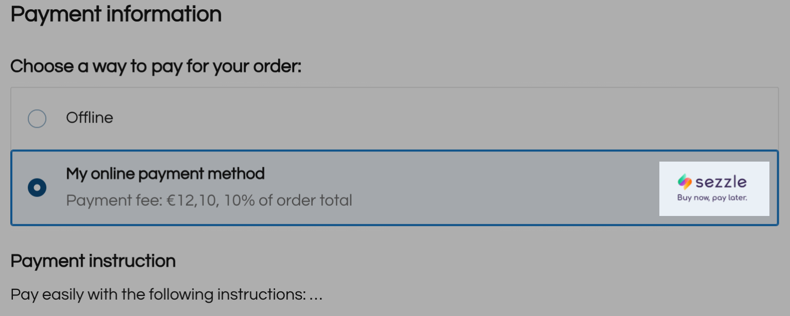

# Show payment icons near your payment method at the checkout

When you add a new payment method to the checkout, it’s displayed without any payment icons on the storefront. However, you can show icons like Visa or AMEX near your payment method to earn more trust from customers.

You need a self-hosted JavaScript file assigned to the app to do so. [Set up self-hosted JS file](https://app.gitbook.com/s/aRJpOy0U8IpbjUfcox4D/get-started)

Use the following script as a template for adding an image of payment icon to your payment method. It only requires a link to the image and your app’s `client_id`:

```javascript
var client_id = "custom-app-1003-1"  //  your app’s client_id
var image_link = "https://mitra-sezzle.free.nf/img/Color-BuyNowPayLater.png"  //  your image URL (must be https)

// function that adds an image
var CheckoutIconLoad = function () {
   var icon = "<div class='icon_resizer' style='height:40px; overflow:hidden'> </img> </div>";
   document.querySelector("label.ec-radiogroup__item--app_id-"+client_id+" div.ec-radiogroup__info:empty").innerHTML = icon;
}

// call function on the page load
Ecwid.OnAPILoaded.add(function () {
   Ecwid.OnPageLoaded.add(function (page) {
      if (page.type == "CHECKOUT_PAYMENT_DETAILS") {
         CheckoutIconLoad();
      }
   });
});
```

How it looks at the checkout:

<figure><figcaption></figcaption></figure>
