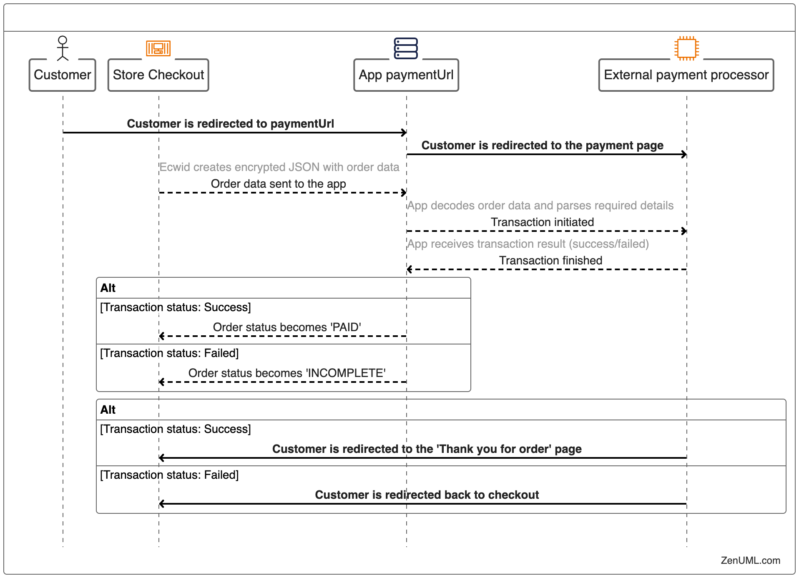

# Online payments overview

Online payments in Ecwid stores always start with a customer going through the store checkout. At the last checkout step, a customer selects one of the available payment methods and clicks the “**Go to Payment**” button. \

At this moment, the online payment processing flow starts:

<figure><figcaption></figcaption></figure>

Both storefront and backend processes happen at the same time.

During the first step, the customer is redirected to app's `paymentUrl` and at the same time the order data is sent to the same endpoint.&#x20;

From there, the app handles both the storefront by redirecting customers to the payment page and back, and the backend by processing requests from Ecwid and callbacks from the payment provider.

Learn how to add a new online payment method to the store:

[Add new payment method to the store with your app](provide-additional-online-payment-method.md)

[Process payment requests from the store](process-online-payment-requests/)
