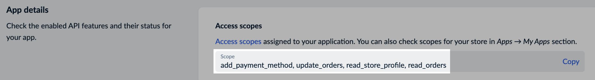
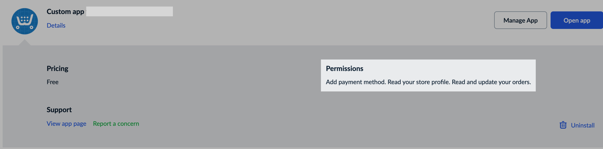
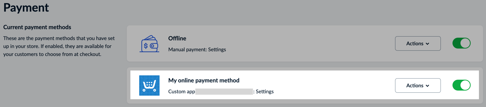
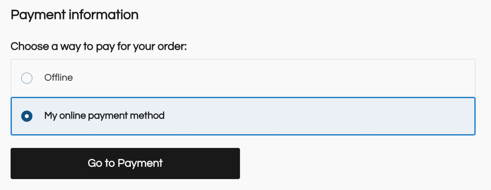

# Provide additional online payment method

Any online payment methods that are not developed by Ecwid team work through applications. The app must meet certain requirements to become available as a payment method in Ecwid admin.

As a developer, you don’t have to do any specific actions or API calls to add a new payment method and make it available at the checkout. However, you need to set up the app correctly:

*   Make sure the app has the `add_payment_method`, `read_store_profile`, `read_orders`, and `update_orders` permissions (access scopes), and the self-hosted `paymentUrl` endpoint for processing payment requests.\
    \
    [Request application update](https://app.gitbook.com/s/uOzT5egoVTAjMJwRuMQT/contact-ecwid-api-support-team)\
    \
    Check your app settings on the app dashboard page:\

    <figure><figcaption></figcaption></figure>
*   Check if the app is installed in the store with all required permissions on the [My apps](https://my.ecwid.com/#my_apps) page:\
    \

    <figure><figcaption></figcaption></figure>

With both requirements satisfied, a new payment method will appear on the [Payments](https://my.ecwid.com/#payments) page immediately after installing the app:

<figure><figcaption></figcaption></figure>

By default, this new payment method is enabled and therefore visible to customers at the checkout:

<figure><figcaption></figcaption></figure>

